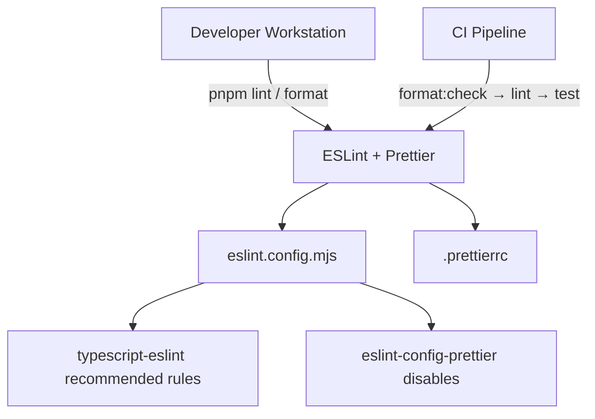

# Design Document: Linting & Formatting

## Overview

This design adds ESLint and Prettier to the existing TypeScript/Pulumi project to enforce consistent code style and catch common errors. The setup uses the flat ESLint config format (`eslint.config.mjs`), integrates `eslint-config-prettier` to avoid rule conflicts, and adds three npm scripts (`lint`, `format`, `format:check`). The CI workflow is updated to gate merges on formatting and linting checks before running tests.

The project already uses pnpm, TypeScript 5, and Vitest. The design introduces no runtime dependencies — all additions are dev-only tooling.

## Architecture

The linting and formatting setup is purely a development tooling concern. It consists of three layers:



1. **Configuration files** — `eslint.config.mjs` and `.prettierrc` at the project root define the rules.
2. **npm scripts** — `lint`, `format`, and `format:check` in `package.json` provide the CLI interface.
3. **CI integration** — The existing GitHub Actions workflow gains two new steps before `pnpm test`.

### Design Decisions

- **Flat config format (`eslint.config.mjs`)**: ESLint's flat config is the current default. The `.mjs` extension ensures ESM parsing without needing `"type": "module"` in `package.json`.
- **`eslint-config-prettier` over `eslint-plugin-prettier`**: The config-only approach simply disables conflicting ESLint rules rather than running Prettier as an ESLint rule. This is the recommended approach — it's faster and avoids confusing error messages.
- **Separate Prettier and ESLint runs**: Prettier handles formatting; ESLint handles logic/style rules. They run as independent steps in CI for clear, actionable feedback.

## Components and Interfaces

### 1. Dev Dependencies (package.json)

New `devDependencies` entries:

| Package                  | Purpose                                                      |
| ------------------------ | ------------------------------------------------------------ |
| `eslint`                 | Core linting engine (latest major)                           |
| `typescript-eslint`      | TypeScript parser + recommended rules for ESLint flat config |
| `prettier`               | Code formatter                                               |
| `eslint-config-prettier` | Disables ESLint rules that conflict with Prettier            |

### 2. ESLint Configuration (`eslint.config.mjs`)

The flat config file exports an array of config objects:

```javascript
import eslint from "@eslint/js";
import tseslint from "typescript-eslint";
import eslintConfigPrettier from "eslint-config-prettier";

export default tseslint.config(
  { ignores: ["node_modules/**", "bin/**"] },
  eslint.configs.recommended,
  ...tseslint.configs.recommended,
  eslintConfigPrettier,
  {
    files: ["**/*.ts"],
  },
);
```

Key aspects:

- `tseslint.config()` helper provides type-safe flat config composition.
- `eslint.configs.recommended` provides base JS rules.
- `tseslint.configs.recommended` adds TypeScript-specific rules (includes the TS parser).
- `eslintConfigPrettier` is placed last to override any formatting-related rules.
- `ignores` at the top-level config object applies globally (equivalent to `.eslintignore`).

### 3. Prettier Configuration (`.prettierrc`)

A minimal JSON config:

```json
{
  "semi": true,
  "singleQuote": false,
  "trailingComma": "all",
  "printWidth": 80,
  "tabWidth": 2
}
```

These defaults align with the existing codebase style (double quotes, semicolons, 2-space indentation visible in current source files).

### 4. npm Scripts (package.json)

```json
{
  "scripts": {
    "lint": "eslint . --max-warnings 0",
    "format": "prettier --write .",
    "format:check": "prettier --check ."
  }
}
```

- `lint`: Runs ESLint on the project root (flat config auto-discovers `eslint.config.mjs`). `--max-warnings 0` ensures warnings also fail the check.
- `format`: Writes formatted output in-place.
- `format:check`: Exits non-zero if any file is not formatted — used in CI.

### 5. CI Workflow Update (`.github/workflows/ci.yml`)

Two new `run` steps inserted between `pnpm install` and `pnpm test`:

```yaml
- run: pnpm format:check
- run: pnpm lint
- run: pnpm test
```

Each step fails the build independently on non-zero exit. The order (format → lint → test) gives the fastest, most actionable feedback first.

## Data Models

This feature introduces no application data models. The only "data" involved are the configuration file structures described above (ESLint config array, Prettier JSON options, and package.json script entries), which are static configuration artifacts rather than runtime data.

## Error Handling

This feature is purely tooling configuration. Error handling is delegated to the tools themselves:

| Scenario                         | Handling                                                                                   |
| -------------------------------- | ------------------------------------------------------------------------------------------ |
| ESLint finds violations          | `eslint` exits non-zero, CI step fails, developer sees file/line/rule in output            |
| Prettier finds unformatted files | `prettier --check` exits non-zero, CI step fails, developer sees list of unformatted files |
| Invalid ESLint config            | `eslint` exits with a parse error pointing to `eslint.config.mjs`                          |
| Invalid Prettier config          | `prettier` exits with a parse error pointing to `.prettierrc`                              |
| Missing dev dependencies         | `pnpm lint` / `pnpm format` fail with "command not found" — resolved by `pnpm install`     |

The `--max-warnings 0` flag on the lint script ensures that ESLint warnings are treated as errors in CI, preventing gradual quality degradation.


