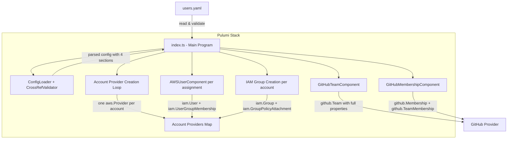
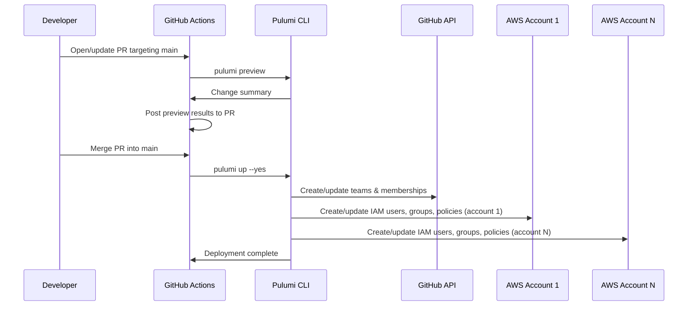

# Design Document: Pulumi User Management

## Overview

This design describes a Pulumi TypeScript project that manages GitHub organization membership and AWS IAM users across multiple AWS accounts from a single YAML configuration file with four root-level sections: `aws_accounts`, `github_teams`, `iam_groups`, and `users`. The system reads `users.yaml`, validates it (including cross-reference checks between sections and across accounts), and declaratively provisions:

- GitHub teams with full property support (description, privacy, parent team, notification settings, LDAP DN, create default maintainer) and user-to-team memberships
- Per-account AWS providers using role assumption from Pulumi stack config secrets
- AWS IAM users deployed to the correct account based on per-user `iam_assignments`
- Account-scoped IAM groups with least-privilege policy attachments (multiple policies, permission boundaries, IAM paths)

The project uses Pulumi Component Resources for encapsulation, supports multi-environment deployment via Pulumi stacks (dev/staging/prod), stores secrets through Pulumi's built-in secret management, and ships with a GitHub Actions CI pipeline and unit tests using Pulumi mocks.

### Key Design Decisions

1. **Four-section YAML config as source of truth** — AWS accounts, GitHub teams, IAM groups, and users are defined in separate sections of `users.yaml`. Account names are the only data in YAML; role ARNs and regions live in Pulumi stack config as secrets. No credentials in source control.
2. **One AWS provider per account via role assumption** — `index.ts` creates an `aws.Provider` per `aws_accounts` entry by reading the role ARN and region from Pulumi stack config. All IAM resources for that account receive `{ provider: accountProviders[accountName] }`.
3. **IAM groups scoped to account** — Uniqueness is the `name`+`account` pair. The same group name can exist in different accounts.
4. **Per-user multi-account IAM assignments** — Users have an `iam_assignments` list instead of a single `iam_group`. Each assignment specifies an `account` and `iam_group`, creating one IAM user per assignment in the correct account.
5. **Component Resources over raw resources** — Each logical grouping (GitHub team, GitHub membership, AWS user) is a Pulumi `ComponentResource`, enabling reuse and clean resource tree organization. `AWSUserComponent` now accepts a `provider` option to deploy to the correct account.
6. **Cross-reference validation before resource creation** — The config is parsed and validated (schema, naming convention, cross-references between sections including account references on groups and user assignments) before any Pulumi resources are registered.
7. **Stack-name prefixing for namespace isolation** — Every resource name is prefixed with the Pulumi stack name, so dev/staging/prod never collide.
8. **Least-privilege IAM by default** — IAM groups default to `ReadOnlyAccess` if no policy is specified, and support multiple policies, permission boundaries, and IAM paths for fine-grained access control.

## Architecture



### Deployment Flow



## Components and Interfaces

### Project Structure

```
.
├── Pulumi.yaml                  # Pulumi project definition
├── Pulumi.dev.yaml              # Dev stack config (secrets incl. per-account role ARNs)
├── Pulumi.staging.yaml          # Staging stack config
├── Pulumi.prod.yaml             # Prod stack config
├── users.yaml                   # User configuration file (4 sections)
├── index.ts                     # Entry point
├── src/
│   ├── config.ts                # ConfigLoader: YAML parsing + validation + cross-ref checks
│   ├── naming.ts                # Naming convention utilities
│   └── components/
│       ├── github-team.ts       # GitHubTeamComponent (full github.Team properties)
│       ├── github-membership.ts # GitHubMembershipComponent
│       └── aws-user.ts          # AWSUserComponent (accepts provider option)
├── tests/
│   ├── arbitraries.ts           # Shared test arbitraries (fast-check generators)
│   ├── config.test.ts           # Config loading + validation tests
│   ├── naming.test.ts           # Naming convention tests
│   └── github-membership.test.ts # GitHub membership tests
├── .github/
│   └── workflows/
│       ├── ci.yml               # Test CI pipeline (every push/PR)
│       └── deploy.yml           # Deploy pipeline (preview on PR, deploy on merge)
├── package.json
├── pnpm-lock.yaml
├── tsconfig.json
├── vitest.config.ts
└── README.md
```

### ConfigLoader (`src/config.ts`)

Responsible for reading, parsing, and validating `users.yaml` with its four root-level sections.

```typescript
interface AWSAccountEntry {
  name: string;
}

interface GitHubTeamEntry {
  name: string;
  description?: string;
  privacy?: "closed" | "secret";
  parent_team_id?: number;
  parent_team_read_id?: number;
  parent_team_read_slug?: string;
  notification_setting?: string;
  ldap_dn?: string;
  create_default_maintainer?: boolean;
}

interface IAMGroupEntry {
  name: string;
  account: string; // required — references an aws_accounts entry
  policy_arn?: string;
  policy_arns?: string[];
  path?: string;
  permission_boundary?: string;
}

interface IAMAssignment {
  account: string;  // references an aws_accounts entry
  iam_group: string; // references an iam_groups entry for that account
}

interface UserEntry {
  name: string;
  github_team: string;
  iam_assignments: IAMAssignment[];
}

interface UsersConfig {
  aws_accounts: AWSAccountEntry[];
  github_teams: GitHubTeamEntry[];
  iam_groups: IAMGroupEntry[];
  users: UserEntry[];
}

function loadConfig(filePath: string): UsersConfig;
function validateConfig(config: UsersConfig): void; // throws on invalid
```

- `loadConfig` reads the YAML file synchronously (Pulumi programs run synchronously at preview time).
- `validateConfig` checks:
  - The config has all four required sections: `aws_accounts`, `github_teams`, `iam_groups`, `users`.
  - Each `aws_accounts` entry has a `name`.
  - Each `github_teams` entry has at minimum a `name`.
  - Each `iam_groups` entry has a `name` and a required `account` referencing a defined AWS account.
  - Each user has `name`, `github_team`, and `iam_assignments` (non-empty array).
  - Each `iam_assignments` entry has `account` and `iam_group`.
  - All names match `/^[a-z0-9]+(-[a-z0-9]+)*$/` (lowercase alphanumeric with hyphens).
  - No duplicate names within `aws_accounts`.
  - No duplicate team names within `github_teams`.
  - No duplicate `name`+`account` pairs within `iam_groups`.
  - No duplicate user names within `users`.
  - If `privacy` is specified on a team, it must be `"closed"` or `"secret"`.
  - **Cross-reference validation**:
    - Every `iam_groups` entry's `account` must match a `name` in `aws_accounts`.
    - Every user's `github_team` must match a `name` in `github_teams`.
    - Every user's `iam_assignments[].account` must match a `name` in `aws_accounts`.
    - Every user's `iam_assignments[].iam_group` must match an IAM group defined for that specific account in `iam_groups`.

### Naming Utility (`src/naming.ts`)

```typescript
function resourceName(stackName: string, ...parts: string[]): string;
```

Produces `{stackName}-{part1}-{part2}-...` in lowercase with hyphens. Validates that all parts conform to the allowed character set. Unchanged from current implementation.

### GitHubTeamComponent (`src/components/github-team.ts`)

```typescript
interface GitHubTeamComponentArgs {
  teamSlug: string;
  description?: string;
  privacy?: "closed" | "secret";
  parentTeamId?: number;
  parentTeamReadId?: number;
  parentTeamReadSlug?: string;
  notificationSetting?: string;
  ldapDn?: string;
  createDefaultMaintainer?: boolean;
}

class GitHubTeamComponent extends pulumi.ComponentResource {
  public readonly team: github.Team;
  constructor(
    name: string,
    args: GitHubTeamComponentArgs,
    opts?: pulumi.ComponentResourceOptions,
  );
}
```

Creates a single `github.Team` resource with all supported properties. The resource name is derived via `resourceName(stackName, args.teamSlug)`. Optional properties are passed through to the `github.Team` resource only when defined.

### GitHubMembershipComponent (`src/components/github-membership.ts`)

```typescript
interface GitHubMembershipComponentArgs {
  username: string;
  teamSlug: string;
  role?: string; // defaults to "member"
}

class GitHubMembershipComponent extends pulumi.ComponentResource {
  public readonly membership: github.Membership;
  public readonly teamMembership: github.TeamMembership;
  constructor(
    name: string,
    args: GitHubMembershipComponentArgs,
    opts?: pulumi.ComponentResourceOptions,
  );
}
```

Creates `github.Membership` (org-level) and `github.TeamMembership` (team-level). Role defaults to `"member"`. Unchanged from current implementation.

### AWSUserComponent (`src/components/aws-user.ts`)

```typescript
interface AWSUserComponentArgs {
  username: string;
  groupName: string; // IAM group name — references a group from iam_groups section
}

class AWSUserComponent extends pulumi.ComponentResource {
  public readonly user: aws.iam.User;
  public readonly groupMembership: aws.iam.UserGroupMembership;
  constructor(
    name: string,
    args: AWSUserComponentArgs,
    opts?: pulumi.ComponentResourceOptions, // provider passed here for account targeting
  );
}
```

Creates an `aws.iam.User` and an `aws.iam.UserGroupMembership`. The caller passes the correct account's `aws.Provider` via `opts.provider` (or `opts.providers`) so all child resources deploy to the right account. Policy management is handled at the IAM group level from the `iam_groups` config section.

### Entry Point (`index.ts`)

```typescript
// Pseudocode flow
const usersConfig = loadConfig("users.yaml");
validateConfig(usersConfig); // includes cross-reference validation

const stackName = pulumi.getStack();
const pulumiConfig = new pulumi.Config();
const DEFAULT_POLICY_ARN = "arn:aws:iam::aws:policy/ReadOnlyAccess";

// 1. Create one AWS provider per account using role assumption from stack config
const accountProviders: Record<string, aws.Provider> = {};
for (const acct of usersConfig.aws_accounts) {
  const roleArn = pulumiConfig.requireSecret(`aws:${acct.name}:roleArn`);
  const region = pulumiConfig.require(`aws:${acct.name}:region`);
  accountProviders[acct.name] = new aws.Provider(
    resourceName(stackName, acct.name, "provider"),
    {
      assumeRole: { roleArn },
      region,
    },
  );
}

// 2. Create GitHub teams from github_teams section
const teams: Record<string, GitHubTeamComponent> = {};
for (const teamDef of usersConfig.github_teams) {
  teams[teamDef.name] = new GitHubTeamComponent(
    resourceName(stackName, teamDef.name),
    {
      teamSlug: teamDef.name,
      description: teamDef.description,
      privacy: teamDef.privacy,
      parentTeamId: teamDef.parent_team_id,
      // ... other optional properties
    },
  );
}

// 3. Create IAM groups scoped to accounts with policy attachments
// Key: "accountName/groupName"
const groups: Record<string, aws.iam.Group> = {};
for (const groupDef of usersConfig.iam_groups) {
  const provider = accountProviders[groupDef.account];
  const groupResourceName = resourceName(stackName, groupDef.account, groupDef.name);
  const g = new aws.iam.Group(groupResourceName, {
    name: resourceName(stackName, groupDef.name),
    path: groupDef.path,
  }, { provider });

  const policyArns: string[] = groupDef.policy_arns
    ?? (groupDef.policy_arn ? [groupDef.policy_arn] : [DEFAULT_POLICY_ARN]);

  for (let i = 0; i < policyArns.length; i++) {
    new aws.iam.GroupPolicyAttachment(
      resourceName(stackName, groupDef.account, groupDef.name, `policy-${i}`),
      { group: g.name, policyArn: policyArns[i] },
      { provider },
    );
  }

  groups[`${groupDef.account}/${groupDef.name}`] = g;
}

// 4. Create per-user resources
for (const user of usersConfig.users) {
  // GitHub membership (once per user)
  new GitHubMembershipComponent(
    resourceName(stackName, user.name, "github"),
    { username: user.name, teamSlug: user.github_team },
    { dependsOn: [teams[user.github_team]] },
  );

  // One IAM user per iam_assignment
  for (const assignment of user.iam_assignments) {
    const provider = accountProviders[assignment.account];
    const groupKey = `${assignment.account}/${assignment.iam_group}`;

    new AWSUserComponent(
      resourceName(stackName, user.name, assignment.account, "aws"),
      {
        username: resourceName(stackName, user.name),
        groupName: resourceName(stackName, assignment.iam_group),
      },
      { provider, dependsOn: [groups[groupKey]] },
    );
  }
}
```

## Data Models

### User Configuration Schema (`users.yaml`)

```yaml
aws_accounts:
  - name: dev-account
  - name: prod-account

github_teams:
  - name: backend
    description: "Backend engineering team"
    privacy: closed
  - name: frontend
    description: "Frontend engineering team"
    privacy: secret
    notification_setting: notifications_enabled
  - name: platform
    parent_team_read_slug: engineering
    create_default_maintainer: false

iam_groups:
  - name: backend-developers
    account: dev-account
    policy_arns:
      - "arn:aws:iam::aws:policy/AmazonS3ReadOnlyAccess"
      - "arn:aws:iam::aws:policy/AmazonDynamoDBReadOnlyAccess"
    path: "/engineering/"
  - name: backend-developers
    account: prod-account
    policy_arn: "arn:aws:iam::aws:policy/AmazonS3ReadOnlyAccess"
  - name: frontend-developers
    account: dev-account
    policy_arn: "arn:aws:iam::aws:policy/AmazonS3ReadOnlyAccess"
  - name: readonly-users
    account: dev-account
    # No policy specified — defaults to ReadOnlyAccess

users:
  - name: alice
    github_team: backend
    iam_assignments:
      - account: dev-account
        iam_group: backend-developers
      - account: prod-account
        iam_group: backend-developers
  - name: bob
    github_team: frontend
    iam_assignments:
      - account: dev-account
        iam_group: frontend-developers
```

**AWS Account Entry Constraints:**

- `name`: required, must match `/^[a-z0-9]+(-[a-z0-9]+)*$/`
- No duplicate `name` values within `aws_accounts`
- Role ARN and region are stored in Pulumi stack config, not in YAML

**User Entry Constraints:**

- `name`: required, must match `/^[a-z0-9]+(-[a-z0-9]+)*$/`
- `github_team`: required, must match same pattern, must reference a name in `github_teams`
- `iam_assignments`: required, non-empty array of `{ account, iam_group }` objects
- Each `iam_assignments[].account` must reference a name in `aws_accounts`
- Each `iam_assignments[].iam_group` must reference an IAM group defined for that specific account in `iam_groups`
- No duplicate `name` values within `users`

**GitHub Team Entry Constraints:**

- `name`: required, must match `/^[a-z0-9]+(-[a-z0-9]+)*$/`
- `description`: optional string
- `privacy`: optional, must be `"closed"` or `"secret"`
- `parent_team_id`: optional number
- `parent_team_read_id`: optional number
- `parent_team_read_slug`: optional string
- `notification_setting`: optional string
- `ldap_dn`: optional string
- `create_default_maintainer`: optional boolean
- No duplicate `name` values within `github_teams`

**IAM Group Entry Constraints:**

- `name`: required, must match `/^[a-z0-9]+(-[a-z0-9]+)*$/`
- `account`: required, must reference a name in `aws_accounts`
- `policy_arn`: optional string (single managed policy ARN)
- `policy_arns`: optional string array (multiple managed policy ARNs)
- `path`: optional string (IAM path)
- `permission_boundary`: optional string (permission boundary policy ARN)
- If neither `policy_arn` nor `policy_arns` is specified, defaults to `arn:aws:iam::aws:policy/ReadOnlyAccess`
- No duplicate `name`+`account` pairs within `iam_groups`

### Pulumi Stack Configuration

Each stack file (`Pulumi.{env}.yaml`) contains per-account role ARNs and regions as secrets:

```yaml
config:
  devops-user-management:usersFile: users.yaml
  devops-user-management:aws:dev-account:roleArn:
    secure: <encrypted-role-arn>
  devops-user-management:aws:dev-account:region: us-east-1
  devops-user-management:aws:prod-account:roleArn:
    secure: <encrypted-role-arn>
  devops-user-management:aws:prod-account:region: us-west-2
  github:token:
    secure: <encrypted-token>
```

AWS credentials for the initial bootstrap (the identity that assumes the per-account roles) are provided via environment variables or the CI secret store, never stored in stack config files.

### Resource Naming Model

| Resource Type     | Name Pattern                                    | Example (stack=dev)                          |
| ----------------- | ----------------------------------------------- | -------------------------------------------- |
| AWS Provider      | `{stack}-{account}-provider`                    | `dev-dev-account-provider`                   |
| GitHub Team       | `{teamSlug}`                                    | `backend`                                    |
| GitHub Membership | `{username}-github`                             | `alice-github`                               |
| IAM User          | `{stack}-{username}-{account}-aws`              | `dev-alice-dev-account-aws`                  |
| IAM Group         | `{stack}-{account}-{group}`                     | `dev-dev-account-backend-developers`         |
| IAM Group Policy  | `{stack}-{account}-{group}-policy-{idx}`        | `dev-dev-account-backend-developers-policy-0`|


## Correctness Properties

_A property is a characteristic or behavior that should hold true across all valid executions of a system — essentially, a formal statement about what the system should do. Properties serve as the bridge between human-readable specifications and machine-verifiable correctness guarantees._

### Property 1: Config loading round-trip

_For any_ valid `UsersConfig` object (with valid `aws_accounts`, `github_teams`, `iam_groups`, and `users` sections including `iam_assignments`), serializing it to YAML and then loading it with `loadConfig` should produce an equivalent `UsersConfig` object with the same accounts, teams, groups, and users with their assignments.

**Validates: Requirements 1.1, 1.2, 1.3**

### Property 2: Resource count matches configuration

_For any_ valid `UsersConfig` with A entries in `aws_accounts`, M entries in `github_teams`, K entries in `iam_groups`, N user entries, and T total `iam_assignments` across all users, the Pulumi program should register exactly A AWS providers, M GitHub team components, N GitHub membership components, T AWS user components (one per assignment), and K IAM groups.

**Validates: Requirements 1.10, 2.1, 3.1, 4.5, 5.1, 10.1**

### Property 3: Naming convention output format

_For any_ valid stack name and any sequence of valid name parts, `resourceName(stackName, ...parts)` should produce a string that starts with the stack name, uses only lowercase alphanumeric characters and hyphens, and matches the pattern `/^[a-z0-9]+(-[a-z0-9]+)*$/`.

**Validates: Requirements 2.2, 3.5, 4.2, 7.1, 7.2**

### Property 4: Validation rejects missing required fields and invalid names

_For any_ config where an `aws_accounts` entry is missing `name`, or a `github_teams` entry is missing `name`, or an `iam_groups` entry is missing `name` or `account`, or a user entry is missing `name`, `github_team`, or `iam_assignments`, or an `iam_assignments` entry is missing `account` or `iam_group`, or where any name contains characters outside the allowed pattern, `validateConfig` should throw a validation error.

**Validates: Requirements 1.5, 1.6, 1.7, 1.8, 6.5, 7.3**

### Property 5: Cross-reference validation rejects unresolved references

_For any_ config where a user's `iam_assignments[].account` does not match any `name` in `aws_accounts`, or a user's `iam_assignments[].iam_group` does not match any IAM group defined for that specific account in `iam_groups`, or a user's `github_team` does not match any `name` in `github_teams`, or an `iam_groups` entry's `account` does not match any `name` in `aws_accounts`, `validateConfig` should throw a descriptive error identifying the unresolved reference.

**Validates: Requirements 6.1, 6.2, 6.3, 6.4**

### Property 6: No duplicate names within sections

_For any_ config containing duplicate `name` values within `aws_accounts`, duplicate `name` values within `github_teams`, duplicate `name`+`account` pairs within `iam_groups`, or duplicate `name` values within `users`, `validateConfig` should throw a descriptive error identifying the duplicate. Conversely, the same group name with different accounts should be accepted.

**Validates: Requirements 5.8, 6.6, 6.7, 6.8, 6.9**

### Property 7: Default membership role

_For any_ GitHub membership created without an explicit role override, the membership role should be `"member"`.

**Validates: Requirements 3.3**

### Property 8: Team membership links to correct team

_For any_ valid user entry with a `github_team` value, the created `TeamMembership` resource should reference the team ID of the `GitHubTeamComponent` created for that `github_team` value in the `github_teams` section.

**Validates: Requirements 3.2**

### Property 9: IAM user assigned to correct group in correct account

_For any_ valid user entry with an `iam_assignments` entry specifying an `account` and `iam_group`, the created `UserGroupMembership` resource should reference the IAM group corresponding to that `iam_group` in the `iam_groups` section for that specific account.

**Validates: Requirements 4.3**

### Property 10: IAM group policy resolution

_For any_ IAM group entry, if `policy_arns` is specified the group should have policy attachments for each ARN in the list; if only `policy_arn` is specified the group should have exactly one attachment with that ARN; if neither is specified the group should have exactly one attachment with `arn:aws:iam::aws:policy/ReadOnlyAccess`.

**Validates: Requirements 5.2, 5.3, 5.4**

### Property 11: GitHub team and IAM group optional properties passthrough

_For any_ `GitHubTeamEntry` with optional properties (`description`, `privacy`, `parent_team_id`, `parent_team_read_id`, `parent_team_read_slug`, `notification_setting`, `ldap_dn`, `create_default_maintainer`) and _for any_ `IAMGroupEntry` with optional properties (`path`, `permission_boundary`), the created resources should reflect those property values.

**Validates: Requirements 2.3, 2.4, 2.5, 2.6, 2.7, 2.8, 5.5, 5.6**

### Property 12: Account provider correctness

_For any_ IAM resource (group, user, policy attachment) scoped to a given account, the resource should be created using the `aws.Provider` instance for that account, which is configured with the role ARN and region from the Pulumi stack configuration for that account name.

**Validates: Requirements 4.1, 10.2, 10.3, 10.4**

## Error Handling

### Configuration Errors

| Error Condition                                                                  | Behavior                                                                  | Timing                   |
| -------------------------------------------------------------------------------- | ------------------------------------------------------------------------- | ------------------------ |
| `users.yaml` file not found                                                     | Throw `Error` with message indicating file path                           | Before resource creation |
| Invalid YAML syntax                                                              | Throw `Error` with YAML parse error details                               | Before resource creation |
| Missing required section (`aws_accounts`, `github_teams`, `iam_groups`, `users`) | Throw `Error` listing the missing section                                 | Before resource creation |
| Missing required field on user (`name`, `github_team`, `iam_assignments`)        | Throw `Error` listing the missing field and user index                    | Before resource creation |
| Missing required field on iam_assignment (`account`, `iam_group`)                | Throw `Error` listing the missing field, user index, and assignment index | Before resource creation |
| Missing required field on aws_account (`name`)                                   | Throw `Error` listing the missing field and entry index                   | Before resource creation |
| Missing required field on team/group (`name`, `account` for groups)              | Throw `Error` listing the missing field and entry index                   | Before resource creation |
| Invalid characters in any `name`                                                 | Throw `Error` with the offending name and allowed pattern                 | Before resource creation |
| Invalid `privacy` value (not `closed` or `secret`)                              | Throw `Error` with the invalid value and allowed options                  | Before resource creation |
| Duplicate account `name` in `aws_accounts`                                       | Throw `Error` listing the duplicate name                                  | Before resource creation |
| Duplicate team `name` in `github_teams`                                          | Throw `Error` listing the duplicate name                                  | Before resource creation |
| Duplicate `name`+`account` pair in `iam_groups`                                  | Throw `Error` listing the duplicate name and account                      | Before resource creation |
| Duplicate user `name` in `users`                                                 | Throw `Error` listing the duplicate name                                  | Before resource creation |
| User references non-existent `github_team`                                       | Throw `Error` identifying the user and unresolved team reference          | Before resource creation |
| User iam_assignment references non-existent `account`                            | Throw `Error` identifying the user, assignment, and unresolved account    | Before resource creation |
| User iam_assignment references `iam_group` not defined for that account          | Throw `Error` identifying the user, account, and unresolved group         | Before resource creation |
| `iam_groups` entry references non-existent `account`                             | Throw `Error` identifying the group and unresolved account reference      | Before resource creation |

### Provider Errors

| Error Condition                                                    | Behavior                                                        |
| ------------------------------------------------------------------ | --------------------------------------------------------------- |
| Role ARN missing from Pulumi stack config for an account           | Pulumi `requireSecret` throws with descriptive error at startup |
| Region missing from Pulumi stack config for an account             | Pulumi `require` throws with descriptive error at startup       |
| GitHub API authentication failure                                  | Pulumi reports provider error; CI pipeline fails                |
| AWS role assumption failure (invalid ARN, insufficient permissions) | Pulumi reports provider error for that account; CI pipeline fails |
| GitHub user does not exist in org                                  | `github.Membership` resource creation fails with provider error |
| IAM policy ARN does not exist                                      | `GroupPolicyAttachment` fails with AWS error                    |

### CI Pipeline Errors

- If `pulumi preview` fails on a PR, the pipeline posts the failure to the PR and blocks merge.
- If `pulumi up` fails after merge, Pulumi's state tracks partial progress; the next merge will reconcile.
- Secrets not configured in CI environment cause provider initialization failures with clear error messages.

## Testing Strategy

### Dual Testing Approach

This project uses both unit tests and property-based tests:

- **Unit tests** (Vitest + Pulumi mocks): Verify specific examples, edge cases, integration between components, and resource structure using Pulumi's mock infrastructure.
- **Property-based tests** (fast-check): Verify universal properties across randomly generated inputs — config validation, naming conventions, cross-reference validation, policy resolution, resource count invariants, and multi-account provider correctness.

Both are complementary. Unit tests catch concrete bugs with known inputs. Property tests verify general correctness across the input space.

### Property-Based Testing Configuration

- **Library**: [fast-check](https://github.com/dubzzz/fast-check) (TypeScript PBT library)
- **Minimum iterations**: 100 per property test
- **Each test references its design property** with a tag comment:
  ```
  // Feature: pulumi-user-management, Property 1: Config loading round-trip
  ```
- **Each correctness property is implemented by a single property-based test**

### Unit Test Plan

| Test Case                                                                        | What It Verifies       | Type    |
| -------------------------------------------------------------------------------- | ---------------------- | ------- |
| Config with 2 accounts, 2 users, multi-account assignments → correct resource counts | Req 12.2           | Example |
| Invalid config entry → validation error                                          | Req 12.3               | Example |
| Component Resources are `instanceof ComponentResource`                           | Req 2.10, 3.4, 4.4    | Example |
| User referencing non-existent team → descriptive error                           | Req 6.3                | Example |
| User iam_assignment referencing non-existent account → descriptive error         | Req 6.1                | Example |
| User iam_assignment referencing group not in that account → descriptive error    | Req 6.2                | Example |
| iam_groups entry referencing non-existent account → descriptive error            | Req 6.4                | Example |
| Team with all optional properties → properties passed through                    | Req 2.3–2.8            | Example |
| Group with multiple policy_arns → all attached                                   | Req 5.3                | Example |
| Group with no policy → ReadOnlyAccess default                                    | Req 5.4                | Example |
| Group with permission_boundary and path → values set                             | Req 5.5, 5.6           | Example |
| Same group name in different accounts → accepted                                 | Req 5.8                | Example |
| Missing role ARN in stack config → descriptive error                             | Req 10.5               | Example |
| IAM resources use correct account provider                                       | Req 12.5               | Example |

### Property Test Plan

| Property                                  | Generator                                                                  | Assertion                                                                |
| ----------------------------------------- | -------------------------------------------------------------------------- | ------------------------------------------------------------------------ |
| P1: Config round-trip                     | Random `UsersConfig` with valid accounts, users, teams, groups, assignments | `loadConfig(serialize(config))` equals original                         |
| P2: Resource count                        | Random valid configs with varying account/user/team/group/assignment counts | Mock resource counts match expected A providers, M teams, N memberships, T IAM users, K groups |
| P3: Naming format                         | Random valid stack names and name parts                                    | Output matches `/^[a-z0-9]+(-[a-z0-9]+)*$/` and starts with stack name  |
| P4: Validation rejects invalid            | Random entries with missing fields or invalid chars                        | `validateConfig` throws                                                  |
| P5: Cross-ref validation                  | Random configs where references don't resolve (account on groups, team/account/group on users) | `validateConfig` throws with descriptive error              |
| P6: No duplicates                         | Random configs with duplicate account names, team names, name+account groups, user names | `validateConfig` throws with duplicate error                  |
| P7: Default role                          | Random valid users without role override                                   | Membership role is `"member"`                                            |
| P8: Team membership correctness           | Random valid configs                                                       | Each TeamMembership references correct team                              |
| P9: Group membership correctness          | Random valid configs with multi-account assignments                        | Each UserGroupMembership references correct group in correct account     |
| P10: Policy resolution                    | Random IAM group entries with/without policy_arn/policy_arns               | Correct policy ARNs attached (or default ReadOnlyAccess)                 |
| P11: Optional properties passthrough      | Random team/group entries with optional properties                         | Created resources reflect those property values                          |
| P12: Account provider correctness         | Random valid configs with multiple accounts                                | Each IAM resource uses the provider for its account                      |

### Test Execution

```bash
# Run all tests (single execution, no watch mode)
pnpm test

# Run only config tests
npx vitest --run tests/config.test.ts

# Run only naming tests
npx vitest --run tests/naming.test.ts
```
