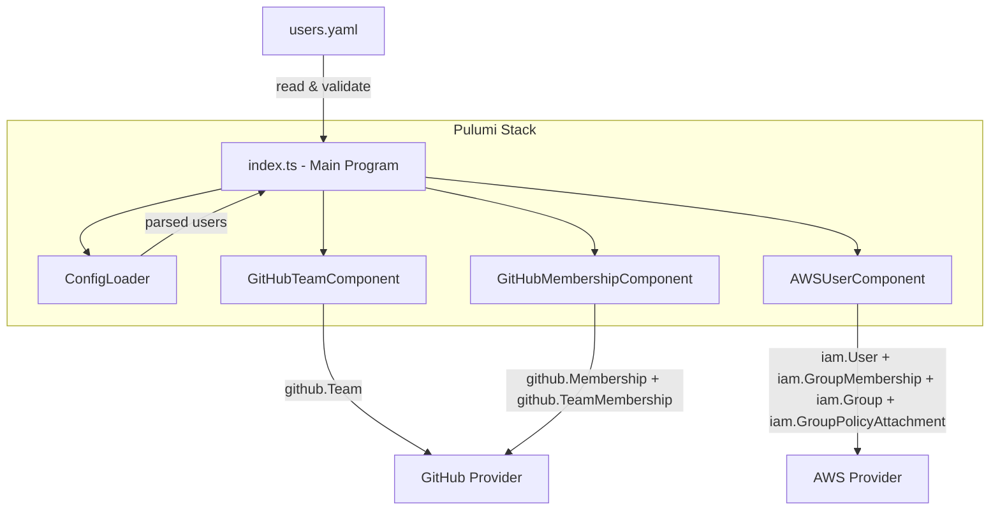
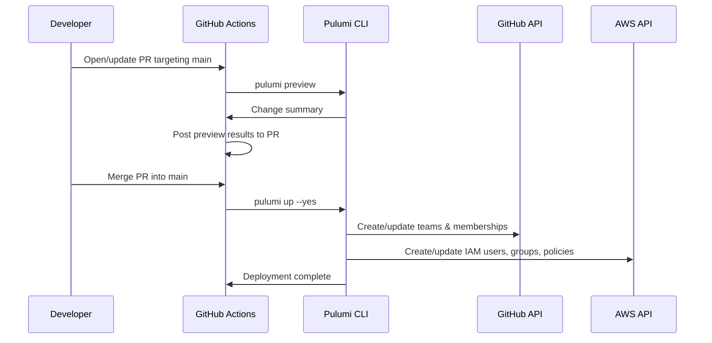

# Design Document: Pulumi User Management

## Overview

This design describes a Pulumi TypeScript project that manages GitHub organization membership and AWS IAM users from a single YAML configuration file. The system reads a `users.yaml` file, validates it, and declaratively provisions:

- GitHub teams and user-to-team memberships
- AWS IAM users, IAM groups (per account/environment), and least-privilege policy attachments

The project uses Pulumi Component Resources for encapsulation, supports multi-environment deployment via Pulumi stacks (dev/staging/prod), stores secrets through Pulumi's built-in secret management, and ships with a GitHub Actions CI pipeline and unit tests using Pulumi mocks.

### Key Design Decisions

1. **Single YAML config as source of truth** — All user/team/group definitions live in `users.yaml`. Pulumi code is purely structural; no user data is hardcoded.
2. **Component Resources over raw resources** — Each logical grouping (GitHub team, GitHub membership, AWS user) is a Pulumi `ComponentResource`, enabling reuse and clean resource tree organization.
3. **Validation before resource creation** — The config is parsed and validated (schema + naming convention) before any Pulumi resources are registered. This gives fast, clear errors.
4. **Stack-name prefixing for namespace isolation** — Every resource name is prefixed with the Pulumi stack name, so dev/staging/prod never collide.
5. **IAM groups created on-demand** — Groups are derived from the set of unique `iam_group` values in config. If no user references a group, it is not created.

## Architecture



### Deployment Flow



## Components and Interfaces

### Project Structure

```
.
├── Pulumi.yaml                  # Pulumi project definition
├── Pulumi.dev.yaml              # Dev stack config (secrets)
├── Pulumi.staging.yaml          # Staging stack config
├── Pulumi.prod.yaml             # Prod stack config
├── users.yaml                   # User configuration file
├── index.ts                     # Entry point
├── src/
│   ├── config.ts                # ConfigLoader: YAML parsing + validation
│   ├── naming.ts                # Naming convention utilities
│   └── components/
│       ├── github-team.ts       # GitHubTeamComponent
│       ├── github-membership.ts # GitHubMembershipComponent
│       └── aws-user.ts          # AWSUserComponent
├── tests/
│   ├── arbitraries.ts           # Shared test arbitraries (fast-check generators)
│   ├── config.test.ts           # Config loading + validation tests
│   ├── naming.test.ts           # Naming convention tests
│   └── index.test.ts            # Unit tests with Pulumi mocks
├── .github/
│   └── workflows/
│       ├── ci.yml               # Test CI pipeline (every push/PR)
│       └── deploy.yml           # Deploy pipeline (preview on PR, deploy on merge)
├── package.json
├── pnpm-lock.yaml
├── tsconfig.json
├── vitest.config.ts
└── README.md
```

### ConfigLoader (`src/config.ts`)

Responsible for reading and validating `users.yaml`.

```typescript
interface UserEntry {
  name: string;
  github_team: string;
  iam_group: string;
}

interface UsersConfig {
  users: UserEntry[];
}

function loadConfig(filePath: string): UsersConfig;
function validateConfig(config: UsersConfig): void; // throws on invalid
```

- `loadConfig` reads the YAML file synchronously (Pulumi programs run synchronously at preview time).
- `validateConfig` checks:
  - Each user has `name`, `github_team`, `iam_group`.
  - Each `name` matches `/^[a-z0-9]+(-[a-z0-9]+)*$/` (lowercase alphanumeric with hyphens).
  - No duplicate user names.

### Naming Utility (`src/naming.ts`)

```typescript
function resourceName(stackName: string, ...parts: string[]): string;
```

Produces `{stackName}-{part1}-{part2}-...` in lowercase with hyphens. Validates that all parts conform to the allowed character set.

### GitHubTeamComponent (`src/components/github-team.ts`)

```typescript
interface GitHubTeamComponentArgs {
  teamSlug: string; // e.g. "backend"
  description?: string;
}

class GitHubTeamComponent extends pulumi.ComponentResource {
  public readonly team: github.Team;
  constructor(
    name: string,
    args: GitHubTeamComponentArgs,
    opts?: pulumi.ComponentResourceOptions,
  );
}
```

Creates a single `github.Team` resource. The resource name is derived via `resourceName(stackName, args.teamSlug)`.

### GitHubMembershipComponent (`src/components/github-membership.ts`)

```typescript
interface GitHubMembershipComponentArgs {
  username: string; // derived from user name via naming convention
  teamSlug: string; // references the team to join
  role?: string; // defaults to "member"
}

class GitHubMembershipComponent extends pulumi.ComponentResource {
  public readonly membership: github.Membership;
  public readonly teamMembership: github.TeamMembership;
  constructor(
    name: string,
    args: GitHubMembershipComponentArgs,
    opts?: pulumi.ComponentResourceOptions,
  );
}
```

Creates `github.Membership` (org-level) and `github.TeamMembership` (team-level). Role defaults to `"member"`.

### AWSUserComponent (`src/components/aws-user.ts`)

```typescript
interface AWSUserComponentArgs {
  username: string;
  groupName: string; // IAM group name (e.g. "dev-dev-account")
  policyArn?: string; // custom policy ARN; defaults to ReadOnlyAccess
}

class AWSUserComponent extends pulumi.ComponentResource {
  public readonly user: aws.iam.User;
  public readonly groupMembership: aws.iam.UserGroupMembership;
  constructor(
    name: string,
    args: AWSUserComponentArgs,
    opts?: pulumi.ComponentResourceOptions,
  );
}
```

Creates an `aws.iam.User` and a `aws.iam.UserGroupMembership`. The IAM group and its policy attachment are created separately in `index.ts` (one per unique `iam_group` value) to avoid duplication.

### Entry Point (`index.ts`)

```typescript
// Pseudocode flow
const config = loadConfig("users.yaml");
validateConfig(config);

const stackName = pulumi.getStack();

// 1. Derive unique teams and groups
const uniqueTeams = [...new Set(config.users.map((u) => u.github_team))];
const uniqueGroups = [...new Set(config.users.map((u) => u.iam_group))];

// 2. Create GitHub teams
const teams: Record<string, GitHubTeamComponent> = {};
for (const team of uniqueTeams) {
  teams[team] = new GitHubTeamComponent(resourceName(stackName, team), {
    teamSlug: team,
  });
}

// 3. Create IAM groups + policy attachments
const groups: Record<string, aws.iam.Group> = {};
for (const group of uniqueGroups) {
  const g = new aws.iam.Group(resourceName(stackName, group));
  new aws.iam.GroupPolicyAttachment(resourceName(stackName, group, "policy"), {
    group: g.name,
    policyArn: "arn:aws:iam::aws:policy/ReadOnlyAccess",
  });
  groups[group] = g;
}

// 4. Create per-user resources
for (const user of config.users) {
  new GitHubMembershipComponent(
    resourceName(stackName, user.name, "github"),
    {
      username: user.name,
      teamSlug: user.github_team,
    },
    { dependsOn: [teams[user.github_team]] },
  );

  new AWSUserComponent(
    resourceName(stackName, user.name, "aws"),
    {
      username: resourceName(stackName, user.name),
      groupName: resourceName(stackName, user.iam_group),
    },
    { dependsOn: [groups[user.iam_group]] },
  );
}
```

## Data Models

### User Configuration Schema (`users.yaml`)

```yaml
users:
  - name: alice
    github_team: backend
    iam_group: developers
  - name: bob
    github_team: frontend
    iam_group: admins
```

**Constraints:**

- `name`: required, must match `/^[a-z0-9]+(-[a-z0-9]+)*$/`
- `github_team`: required, must match same pattern
- `iam_group`: required, must match same pattern
- No duplicate `name` values

### Pulumi Stack Configuration

Each stack file (`Pulumi.{env}.yaml`) contains:

```yaml
config:
  devops-user-management:usersFile: users.yaml # path to config
  github:token:
    secure: <encrypted-token> # Pulumi secret
  aws:region: us-east-1
```

AWS credentials are provided via environment variables (`AWS_ACCESS_KEY_ID`, `AWS_SECRET_ACCESS_KEY`) or the CI secret store, never stored in stack config files.

### Resource Naming Model

| Resource Type     | Name Pattern                 | Example (stack=dev)     |
| ----------------- | ---------------------------- | ----------------------- |
| GitHub Team       | `{teamSlug}`                 | `backend`               |
| GitHub Membership | `{username}-github`          | `alice-github`          |
| IAM User          | `{stack}-{username}`         | `dev-alice`             |
| IAM Group         | `{stack}-{iam_group}`        | `dev-developers`        |
| IAM Group Policy  | `{stack}-{iam_group}-policy` | `dev-developers-policy` |

## Correctness Properties

_A property is a characteristic or behavior that should hold true across all valid executions of a system — essentially, a formal statement about what the system should do. Properties serve as the bridge between human-readable specifications and machine-verifiable correctness guarantees._

### Property 1: Config loading round-trip

_For any_ valid `UsersConfig` object, serializing it to YAML and then loading it with `loadConfig` should produce an equivalent `UsersConfig` object.

**Validates: Requirements 1.1**

### Property 2: Resource count matches configuration

_For any_ valid `UsersConfig` with N user entries, M unique `github_team` values, and K unique `iam_group` values, the Pulumi program should register exactly N GitHub membership components, N AWS user components, M GitHub team components, and K IAM groups.

**Validates: Requirements 1.2, 2.1, 3.1, 4.1, 4.4**

### Property 3: Naming convention output format

_For any_ valid stack name and any sequence of valid name parts, `resourceName(stackName, ...parts)` should produce a string that starts with the stack name, uses only lowercase alphanumeric characters and hyphens, and matches the pattern `/^[a-z0-9]+(-[a-z0-9]+)*$/`.

**Validates: Requirements 6.1, 6.2, 2.2, 3.5, 4.2, 7.2**

### Property 4: Config validation rejects invalid input

_For any_ user entry that is missing a required field (`name`, `github_team`, or `iam_group`) or whose `name` contains characters outside `/^[a-z0-9-]+$/`, `validateConfig` should throw a validation error.

**Validates: Requirements 1.4, 1.5, 6.3**

### Property 5: Team membership links to correct team

_For any_ valid user entry with a `github_team` value, the created `TeamMembership` resource should reference the team ID of the `GitHubTeamComponent` created for that `github_team` value.

**Validates: Requirements 3.2**

### Property 6: Default membership role

_For any_ GitHub membership created without an explicit role override, the membership role should be `"member"`.

**Validates: Requirements 3.3**

### Property 7: IAM user assigned to correct group

_For any_ valid user entry with an `iam_group` value, the created `UserGroupMembership` resource should reference the IAM group corresponding to that `iam_group` value.

**Validates: Requirements 4.3**

### Property 8: Default policy attachment per IAM group

_For any_ IAM group created without a custom policy ARN, the group should have exactly one `GroupPolicyAttachment` with the ARN `arn:aws:iam::aws:policy/ReadOnlyAccess`.

**Validates: Requirements 5.1, 5.2**

## Error Handling

### Configuration Errors

| Error Condition                                             | Behavior                                                  | Timing                   |
| ----------------------------------------------------------- | --------------------------------------------------------- | ------------------------ |
| `users.yaml` file not found                                 | Throw `Error` with message indicating file path           | Before resource creation |
| Invalid YAML syntax                                         | Throw `Error` with YAML parse error details               | Before resource creation |
| Missing required field (`name`, `github_team`, `iam_group`) | Throw `Error` listing the missing field and user index    | Before resource creation |
| Invalid characters in `name`                                | Throw `Error` with the offending name and allowed pattern | Before resource creation |
| Duplicate user `name`                                       | Throw `Error` listing the duplicate name                  | Before resource creation |

### Provider Errors

| Error Condition                   | Behavior                                                        |
| --------------------------------- | --------------------------------------------------------------- |
| GitHub API authentication failure | Pulumi reports provider error; CI pipeline fails                |
| AWS API authentication failure    | Pulumi reports provider error; CI pipeline fails                |
| GitHub user does not exist in org | `github.Membership` resource creation fails with provider error |
| IAM policy ARN does not exist     | `GroupPolicyAttachment` fails with AWS error                    |

### CI Pipeline Errors

- If `pulumi preview` fails on a PR, the pipeline posts the failure to the PR and blocks merge.
- If `pulumi up` fails after merge, Pulumi's state tracks partial progress; the next merge will reconcile.
- Secrets not configured in CI environment cause provider initialization failures with clear error messages.

## Testing Strategy

### Dual Testing Approach

This project uses both unit tests and property-based tests:

- **Unit tests** (Vitest + Pulumi mocks): Verify specific examples, edge cases, integration between components, and resource structure using Pulumi's mock infrastructure.
- **Property-based tests** (fast-check): Verify universal properties across randomly generated inputs — config validation, naming conventions, and resource count invariants.

Both are complementary. Unit tests catch concrete bugs with known inputs. Property tests verify general correctness across the input space.

### Property-Based Testing Configuration

- **Library**: [fast-check](https://github.com/dubzzz/fast-check) (TypeScript PBT library)
- **Minimum iterations**: 100 per property test
- **Each test references its design property** with a tag comment:
  ```
  // Feature: devops-user-management, Property 1: Config loading round-trip
  ```

### Unit Test Plan

| Test Case                                              | What It Verifies  | Type    |
| ------------------------------------------------------ | ----------------- | ------- |
| Two users, two teams config → correct resource counts  | Req 10.2          | Example |
| Invalid config entry → validation error                | Req 10.3          | Example |
| Component Resources are `instanceof ComponentResource` | Req 2.4, 3.4, 4.5 | Example |
| Custom policy ARN overrides default                    | Req 5.3           | Example |
| CI workflow file exists and has correct structure      | Req 9.1           | Example |

### Property Test Plan

| Property                         | Generator                                                    | Assertion                                                              |
| -------------------------------- | ------------------------------------------------------------ | ---------------------------------------------------------------------- |
| P1: Config round-trip            | Random `UsersConfig` objects with valid names/teams/accounts | `loadConfig(serialize(config))` equals original                        |
| P2: Resource count               | Random valid configs with varying user/team/group counts     | Mock resource counts match expected                                    |
| P3: Naming format                | Random valid stack names and name parts                      | Output matches `/^[a-z0-9]+(-[a-z0-9]+)*$/` and starts with stack name |
| P4: Validation rejects invalid   | Random user entries with missing fields or invalid chars     | `validateConfig` throws                                                |
| P5: Team membership correctness  | Random valid configs                                         | Each TeamMembership references correct team                            |
| P6: Default role                 | Random valid users without role override                     | Membership role is `"member"`                                          |
| P7: Group membership correctness | Random valid configs                                         | Each UserGroupMembership references correct group                      |
| P8: Default policy               | Random valid configs without custom policy                   | GroupPolicyAttachment ARN is ReadOnlyAccess                            |

### Test Execution

```bash
# Run all tests (single execution, no watch mode)
npx vitest --run

# Run only property tests
npx vitest --run tests/properties

# Run only unit tests
npx vitest --run tests/unit
```
